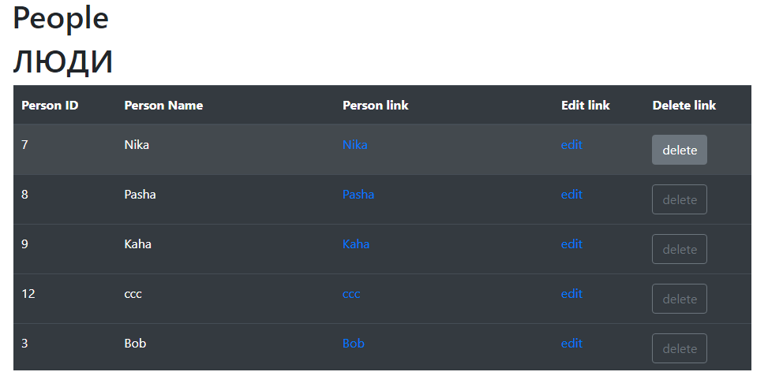
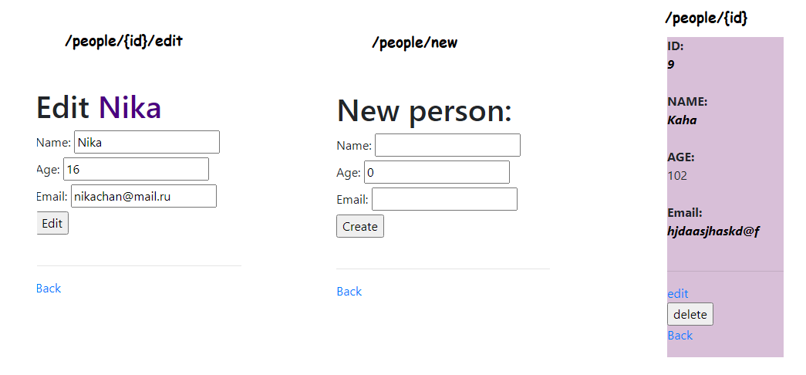
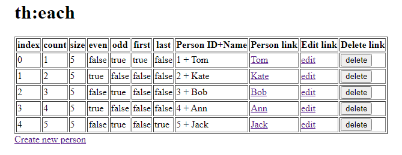
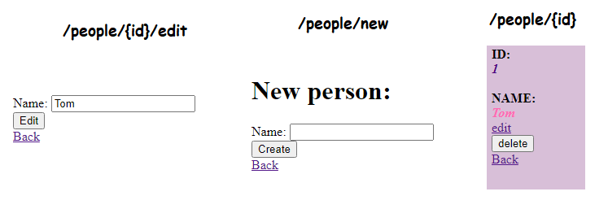

# CRUD apps

---

### project: 2021_05_09_SpringCrudNew

- Spring MVC
- Spring JDBC (JDBC Template)
- Hibernate Validator
- Thymeleaf
- Bootstrap
  
**Server:** Tomcat

**БД:** PostgreSQL

**ORM:** PersonMapper _implements_ RowMapper< _Person_ >

---

Screenshots:

**/people**

---
---
---

## project: 2021_05_08_SpringCrud

- Spring MVC
- Thymeleaf
  
**Server:** Tomcat

**БД:** **List**< _Person_ > people

---

Screenshots:

**/people**

---
---
---

В остальных и более ранних проектах идут примеры и изучение Spring с нуля, XML-конфигурирование, DI/IoC, Аннотации, MVC модель и т.д.

